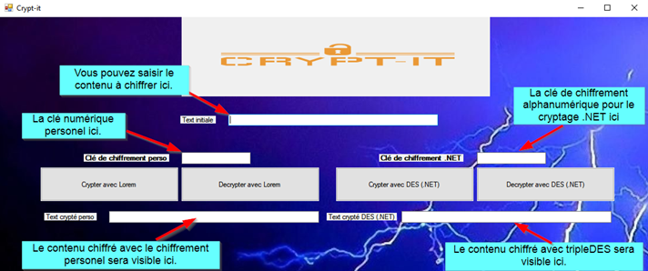

# GD_Cryptage


## Documentation Crypt-it

Ce document explique brièvement le fonctionnement de Crypt-it, une application de chiffrement de
texte saisie par l’utilisateur.

```
Cryptage Lorem ipsum
```
Le cryptage personnel est réalisé en 3 étapes ;

```
1- On va ajouter un texte « Lorem ipsum » à la fin de la saisie de l’utilisateur.
2- On va transformer cette sortie en un tableau de caractère.
3- On va incrémenter chaque élément de ce tableau par le nombre choisi.
```
Pour décrypter on repasse par 3 étapes ;

```
1- On transforme la chaine de caractère en un tableau de caractère.
2- On décrémente chaque élément de ce tableau par le nombre saisi.
3- On enlève le nombre de caractère que le texte « Lorem ipsum » contient.
```
En l’occurrence, le texte est celui-ci :

```
Lorem ipsum dolor sit amet, consectetur adipiscing elit. Morbi et dui ac lectus
hendrerit facilisis sit amet vel enim. Integer eleifend nisi nec felis malesuada, nec
pharetra lacus sagittis. Nullam tincidunt arcu vitae tortor rutrum, a consequat erat
fringilla. Pellentesque venenatis eu eros ac sollicitudin. Quisque auctor venenatis
ante, at suscipit turpis tempor quis. Cras vitae dolor hendrerit, aliquet arcu.
```
Il contient 414 caractères. Il peut être modifié à condition d’adapter le nombre de caractère.

```
Cryptage .ET (tripleDES)
```
La partie .NET du cryptage a été fait avec le cryptage tripleDES. Le cryptage tripleDES est une
méthode de cryptage qui utilise la méthode DES (Data Encryption Standard) pour crypter des
données pour une sécurité maximale. Il est conçu pour crypter à la fois des blocs de données de 64
bits et des mots de passe de 8 caractères. Il est considéré comme beaucoup plus sûr que le cryptage
DES, car il utilise trois cycles de cryptage, ce qui rend beaucoup plus difficile l'accès non autorisé aux
données. Le cryptage tripleDES est largement utilisé pour le cryptage et l'authentification,
notamment dans les applications Web, les systèmes de paiement et les systèmes de
télécommunication. C# fournit une implémentation pour le cryptage tripleDES, ce qui facilite
grandement son utilisation.


GUNGOR Diyar 06/12/

## 2

```
Utilisation de Crypt-it
```

